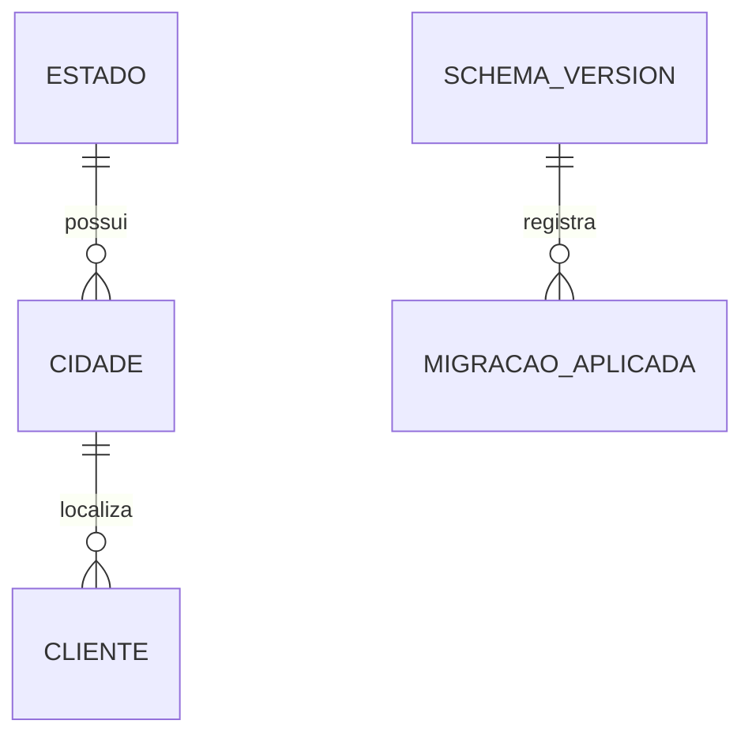

# Parte 01 - Fundação e banco versionado

## Problem

O repositório ainda não oferece uma base compilável, testes automatizados nem persistência. Sem essa fundação, cada tela poderia adotar convenções diferentes e a aplicação dependeria de um banco preparado manualmente.

Quando esta parte estiver pronta, o projeto Delphi conectará ao serviço local do Firebird 3, abrirá uma base limpa ou existente, aplicará migrações versionadas e fornecerá a estrutura testável que as partes seguintes reutilizarão.

## Flow

Esta parte centraliza inicialização, conexão e migrações para que nenhuma tela crie sua própria infraestrutura.

1. início do `CadCli.exe` Win64 -> `TInicializadorAplicacao` (new, door 1) - resolve o caminho absoluto de `cadcli.fdb` ao lado do executável e solicita sua preparação pelo serviço local
2. `TInicializadorBanco` (new, doors 2 e 6) - conecta por FireDAC ao Firebird 3 em `localhost:3050`, abre ou cria o arquivo, garante o bootstrap transacional de `SCHEMA_VERSION` e lê a versão instalada
3. `TExecutorMigracoes` (new, door 3) - recebe do `TCatalogoMigracoes` as classes compiladas, aplica cada migração pendente em ordem dentro de transação e registra a versão
4. out: conexão pronta para os repositórios, ou erro de inicialização sem abrir a interface principal

## Impact

| Front | What changes |
| --- | --- |
| domain | novos termos: `Cliente`, `Cidade`, `Estado`, `Migracao` e `Controlador` |
| stored data | uma instalação nova cria o esquema completo; uma base existente recebe somente migrações ainda não registradas |
| build | a solução terá alvo exclusivo Win64, um único executável de aplicação e um runner DUnitX de desenvolvimento não distribuído |
| runtime | a aplicação deixa de carregar Firebird Embedded ao lado do executável e passa a depender do serviço e da biblioteca cliente instalados no Windows |

## Relations

One-way constraints: `ESTADO.UF` é único; `CIDADE` é única por estado e nome; cada versão de migração é única (doors 3 e 4).

`MIGRACAO_APLICADA` representa conceitualmente cada linha registrada em `SCHEMA_VERSION`; não existe uma segunda tabela com esse nome.

## Surface

None - esta parte não adiciona tela, API ou comando consumido fora da aplicação.

## Landing

| One-way door | Literal shape | Alternative rejected |
| --- | --- | --- |
| 1. plataforma e artefato da aplicação | Delphi 12, configuração `Win64 Release`, `CadCli.exe`, runtime packages desabilitados e nenhum alvo Win32 | compilar Win32 e Win64 duplicaria validação e contrariaria a decisão de entregar um só executável 64 bits |
| 2. persistência por serviço local | FireDAC `DriverID=FB`, `Server=localhost`, `Port=3050`, `User_Name=SYSDBA`, `Password=masterkey`, `OpenMode=OpenOrCreate`, Dialect 3, UTF8 e caminho absoluto `<diretório de CadCli.exe>\cadcli.fdb`, resolvido por `ExtractFilePath(ParamStr(0))`; a biblioteca cliente vem da instalação do Firebird e nenhuma DLL é distribuída na pasta da aplicação | Firebird Embedded exige distribuir e manter o runtime nativo junto do aplicativo; banco remoto ampliaria configuração e escopo multiusuário sem necessidade |
| 3. versionamento do esquema no código | uma unit por versão, nomeada `Migracao.VNNN.Descricao.pas`, contendo uma classe `TMigracaoNNNDescricao` que implementa `IMigracaoBanco`; `TCatalogoMigracoes` registra as classes compiladas no `CadCli.exe`; tabela `SCHEMA_VERSION(VERSAO, DESCRICAO, APLICADA_EM)`; aplicar em ordem e registrar na mesma transação | arquivos `.sql` externos podem ser alterados, perdidos ou ficar dessincronizados do executável; entregar um `.fdb` pronto não atualiza instalações existentes |
| 4. esquema inicial | `CLIENTE(ID INTEGER PK, NOME VARCHAR(80), CEP CHAR(8), CPF_CNPJ VARCHAR(14), ENDERECO VARCHAR(100), NUMERO VARCHAR(20), COMPLEMENTO VARCHAR(60), BAIRRO VARCHAR(100), CIDADEID INTEGER FK, DATANASCIMENTO DATE)`; `ESTADO(ID INTEGER PK, NOME VARCHAR(50), UF CHAR(2))`; `CIDADE(ID INTEGER PK, NOME VARCHAR(50), ESTADOID INTEGER FK)` | alterar nomes ou larguras diverge da especificação fornecida |
| 5. controladores testáveis | toda form própria terá exatamente um `TControlador<Form>`, receberá dependências por interfaces e implementará uma interface de visão passiva; eventos apenas delegam ao controlador | colocar regras em eventos de form acopla comportamento ao VCL e impede testes unitários isolados |
| 6. bootstrap do catálogo de versões | antes de executar o catálogo, `TInicializadorBanco` cria somente `SCHEMA_VERSION(VERSAO, DESCRICAO, APLICADA_EM)` em uma transação própria quando a tabela não existe; o bootstrap não registra versão, e V001 em diante registram cada versão na mesma transação de sua migração | criar `SCHEMA_VERSION` dentro de V001 impediria inserir o registro de V001 antes do commit, porque o Firebird só torna o novo metadado utilizável depois que a DDL é confirmada |

- O serviço local e a biblioteca cliente são responsabilidade da instalação do Firebird 3 x64; o diretório de `CadCli.exe` não contém DLLs do Firebird.

## Criteria

### S1: Projeto compilável e testável (P1)

O repositório passa a ter um alvo de compilação e um runner de testes reproduzíveis.

**Acceptance Criteria**

1. WHEN a configuração Release for compilada THEN a solução SHALL produzir somente `CadCli.exe` para Win64, sem BPLs de runtime e sem executável auxiliar distribuível.
2. WHEN o projeto de testes for executado THEN o runner DUnitX SHALL terminar com código 0 em Win64 sem abrir forms reais.

**Independent test:** compilar a solução em Win64, inspecionar os artefatos e executar o runner DUnitX vazio com um teste de sanidade.

### S2: Base criada e migrada na inicialização (P1)

A aplicação inicia a persistência sem preparação manual.

**Acceptance Criteria**

3. WHEN `<diretório de CadCli.exe>\cadcli.fdb` não existir THEN o sistema SHALL solicitar ao Firebird 3 em `localhost:3050` a criação nesse caminho absoluto de uma base em Dialect 3/UTF8 e aplicar todas as classes de migração compiladas no `CadCli.exe`.
4. WHEN uma migração for aplicada com sucesso THEN o sistema SHALL registrar exatamente uma linha com sua versão, descrição e instante em `SCHEMA_VERSION` na mesma transação.
5. WHEN uma base existente tiver migrações pendentes THEN o sistema SHALL obter as classes pelo `TCatalogoMigracoes` e aplicá-las uma vez, em ordem numérica crescente, antes de abrir a tela principal.
6. IF qualquer instrução de uma migração falhar THEN o sistema SHALL reverter essa migração, não registrar sua versão e exibir erro de inicialização contendo a versão que falhou.
7. IF a base registrar uma versão maior que a suportada pelo executável THEN o sistema SHALL recusar a abertura e informar que a aplicação precisa ser atualizada.
8. WHEN a migração inicial terminar THEN o sistema SHALL conter `CLIENTE`, `ESTADO` e `CIDADE` com todos os campos, larguras, chaves primárias e estrangeiras definidos no door 4.
9. WHEN a migração inicial terminar THEN o sistema SHALL conter Minas Gerais/MG com Belo Horizonte, Uberlândia e Contagem; São Paulo/SP com São Paulo, Campinas e Santos; Rio de Janeiro/RJ com Rio de Janeiro, Niterói e Petrópolis; e Bahia/BA com Salvador, Feira de Santana e Vitória da Conquista, garantindo pelo menos três cidades associadas a cada estado.
10. WHEN a base já estiver na versão suportada THEN o sistema SHALL iniciar sem executar DDL nem duplicar dados de referência.
11. IF o serviço Firebird 3 em `localhost:3050` estiver indisponível ou recusar a conexão THEN o sistema SHALL não abrir a interface principal, encerrar a inicialização com código `1` e registrar uma mensagem que identifique a indisponibilidade do serviço sem expor credenciais.

**Independent test:** usando um serviço local Firebird 3 isolado, apontar a inicialização para um diretório temporário e provar criação limpa, segunda execução idempotente, atualização de uma versão anterior, rollback de migração inválida, recusa de versão futura e falha quando o serviço estiver indisponível.

## Out of scope

| Excluded | Why |
| --- | --- |
| autenticação de usuários | não foi solicitada e não existe servidor de identidade |
| servidor remoto ou uso multiusuário | a entrega usa somente o serviço Firebird da própria máquina |
| backup e restauração pela interface | não são necessários para provar o cadastro solicitado |
| implementação das forms | pertence às partes 02 a 04 |

## Assumptions

| Assumption | Chosen default | Rationale | Confirmed? |
| --- | --- | --- | --- |
| versão da IDE entre as permitidas | Delphi 12 | é a opção mais atual aceita pelo enunciado e suporta Win64 |  s|
| disponibilidade de componentes comerciais | DevExpress VCL e ReportBuilder compatíveis com Delphi 12 estarão instalados no ambiente de build | o enunciado obriga ambos, mas não fornece instaladores ou licenças |  s|
| criação de IDs | sequência Firebird por entidade, consumida pelo repositório | mantém IDs inteiros e geração atômica sem `MAX(ID)+1` |  s|
| crescimento do histórico de migrações | manter todas as classes enquanto houver bases suportadas que possam precisar delas; consolidar uma baseline somente ao elevar formalmente a versão mínima suportada | preserva atualização de instalações antigas sem manter histórico indefinido depois de encerrado o suporte |  s|
| serviço e credenciais locais | Firebird 3 x64 em `localhost:3050`, com `SYSDBA`/`masterkey` e biblioteca cliente acessível no sistema | contrato confirmado para eliminar o runtime Embedded da pasta da aplicação | s |

**Open questions:** none - todas as decisões possuem default revisável acima.

## Observable

| Surface | Decision | Landing |
| --- | --- | --- |
| inicialização de `CadCli.exe` | error state | AC 6, AC 7 e AC 11 - erro identifica migração, versão futura ou serviço indisponível sem expor credenciais |
| dependency `Firebird 3 local` | endpoint and authentication | door 2 - `localhost:3050`, `SYSDBA`/`masterkey`, biblioteca cliente fornecida pela instalação do Firebird |

## Sources

- [Teste Programador Delphi 2026.md](../../Teste%20Programador%20Delphi%202026.md) - fonte vinculante para plataforma, componentes e esquema exigidos.
- [Conexão Firebird com FireDAC](https://docwiki.embarcadero.com/RADStudio/Athens/en/Connect_to_Firebird_%28FireDAC%29) - confirma conexão por servidor, `OpenMode=OpenOrCreate` e parâmetros do driver.
- [Firebird 3.0 Language Reference](https://www.firebirdsql.org/file/documentation/html/en/refdocs/fblangref30/firebird-30-language-reference.html) - confirma criação de base, Dialect 3 e DDL transacional.
