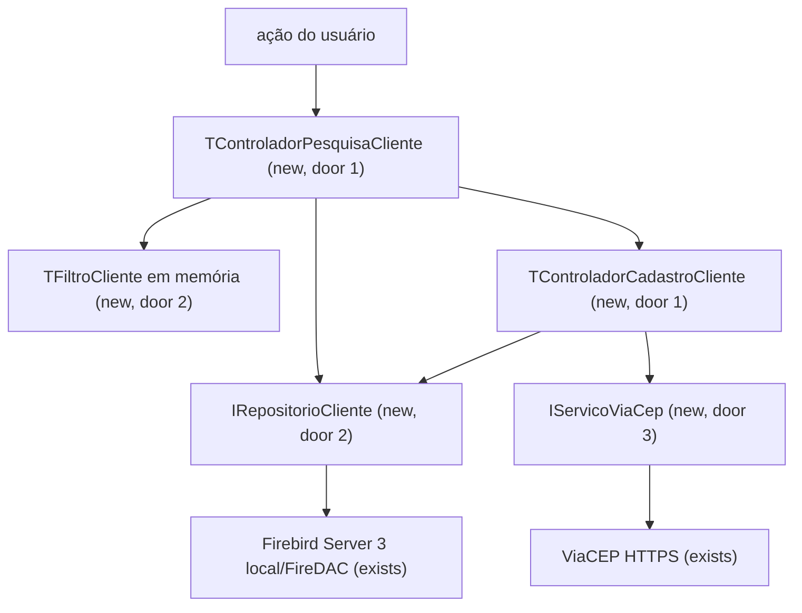
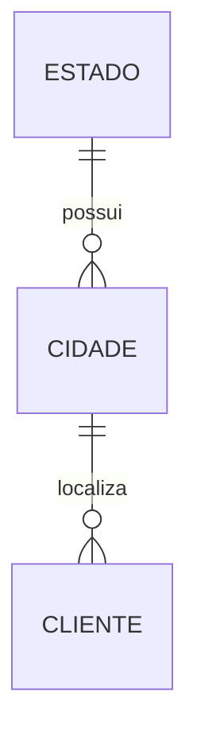

# Parte 03 - CRUD e pesquisa de clientes

## Problem

O sistema ainda não permite cadastrar, localizar, alterar ou excluir clientes conforme o enunciado, e eventos VCL poderiam concentrar regras de validação e acesso ao banco sem cobertura isolada.

Quando esta parte estiver pronta, pesquisa e edição funcionarão em forms DevExpress separadas, cada uma com seu controlador testável, persistência transacional e preenchimento de endereço pelo ViaCEP.

## Flow

Esta parte reutiliza conexão, migrações, entidades e o padrão de visão passiva da parte 01, além da navegação da parte 02.

## Impact

| Front | What changes |
| --- | --- |
| domain | `Cliente` passa a possuir regras de documento, CEP, nascimento e exclusão protegida; `EnderecoViaCep` representa o retorno externo |
| stored data | CRUD altera `CLIENTE`; ViaCEP pode inserir estado/cidade ausentes dentro da mesma transação do salvamento |
| external dependency | consultas HTTPS ao ViaCEP passam a ocorrer ao sair do campo CEP válido |
| UI | entram as forms `PesquisaCliente` e `CadastroCliente`, ambas DevExpress e com controladores próprios; a pesquisa carrega todos os clientes em memória e o controlador filtra por campo e por busca geral com `TFiltroCliente`, sem nova consulta ao banco; a lista multicolunas DevExpress (`TcxMCListBox`, door 5) apenas exibe |

## Relations

One-way constraints: um cliente referencia exatamente uma cidade; UF é única; cidade é única por estado e nome (parte 01).

## Surface

None - nothing consumed outside; as superfícies são as duas forms e a chamada consumidora ao ViaCEP.

## Landing

| One-way door | Literal shape | Alternative rejected |
| --- | --- | --- |
| 1. um controlador por form | `TFormPesquisaCliente : IVisaoPesquisaCliente` + `TControladorPesquisaCliente`; `TFormCadastroCliente : IVisaoCadastroCliente` + `TControladorCadastroCliente` | um controlador compartilhado acumularia estado de duas telas e contrariaria a regra solicitada |
| 2. fronteira de persistência e filtragem | `IRepositorioCliente` expõe incluir, alterar, excluir, obter por ID e listar todos; implementação FireDAC usa somente parâmetros; `TControladorPesquisaCliente` guarda a lista completa em memória, aplica `TFiltroCliente.Atende(Cliente): Boolean` (filtros por campo mais busca geral) e entrega o resultado a `IVisaoPesquisaCliente`, que o exibe em uma grade DevExpress não vinculada ao banco (`TcxGridTableView` em modo não vinculado) com a linha de filtro desabilitada | filtro no SQL com paginação é desnecessário no volume de uma aplicação de teste; a linha de filtro do cxGrid deixaria a regra na visão, fora do MVC e testável só com a form; datasets FireDAC ligados diretamente à grade misturariam consulta, navegação e regra de negócio |
| 3. fronteira de CEP | `IServicoViaCep.Consultar(CEP)` retorna encontrado/endereço ou erros tipados de formato, não encontrado, indisponível e resposta inválida; o corpo JSON é desserializado com `System.JSON` (`TJSONObject.ParseJSONValue`) em um objeto `TEnderecoViaCep` (`CEP`, `Logradouro`, `Complemento`, `Bairro`, `Localidade`, `UF`, `Estado`) dentro do serviço, e o controlador consome apenas esse objeto | HTTP dentro da form impede teste determinístico e tratamento consistente; ler o JSON campo a campo no controlador espalharia o contrato externo; `REST.Json.TJson.JsonToObject` exigiria nomes de campos iguais às chaves do ViaCEP e esconderia chaves ausentes |
| 4. regra de exclusão | conjunto imutável de IDs protegidos `{1, 5, 8, 10, 15}` validado por `TControladorPesquisaCliente` antes da transação; a exclusão é acionada somente na tela de pesquisa, e `TControladorCadastroCliente` não exclui | trigger ocultaria a regra da interface e ainda exigiria tratamento posterior da exceção |
| 5. lista de resultados da pesquisa (AD-015; substitui a grade `TcxGridTableView` do door 2) | `TFormPesquisaCliente.ListaClientes: TcxMCListBox` sem dataset, uma `HeaderSection` por coluna, `Sorted = False` e seções sem clique, preenchida por `IVisaoPesquisaCliente.ExibirClientes` na ordem entregue pelo controlador; o estado vazio é um `TcxLabel` `RotuloSemResultado` sobre a lista | `TcxGridTableView` exige `cxInplaceContainer`, que com o Delphi 12.1 local e os `.dcp` do DevExpress 2026.1.4 trial falha com E2225 e não pode ser recompilado sem fontes; `TListView`/`TStringGrid` da VCL violariam a regra de controles DevExpress |

- Nothing else in this change is hard to reverse.

## Criteria

### S1: Pesquisa de clientes (P1)

O usuário encontra registros e escolhe criar, editar ou excluir.

**Acceptance Criteria**

1. WHEN a tela de pesquisa abrir THEN `TControladorPesquisaCliente` SHALL carregar todos os clientes do banco em uma única consulta, mantê-los em memória e entregá-los à visão para exibição em grade ordenada por ID crescente com ID, nome, CPF/CNPJ, CEP, cidade, UF, estado e data de nascimento.
2. WHEN o usuário acionar `Pesquisar` com filtros por campo preenchidos no painel de filtros DevExpress THEN a visão SHALL montar um `TFiltroCliente` e `TControladorPesquisaCliente` SHALL exibir somente os clientes em memória que satisfaçam `TFiltroCliente.Atende`, sem nova consulta ao banco, combinando por `AND` os campos preenchidos: ID exato, nome contendo texto sem diferença de caixa, CPF/CNPJ por dígitos exatos, CEP por oito dígitos exatos, cidade contendo texto sem diferença de caixa, estado por UF exata ou nome contendo texto sem diferença de caixa e data de nascimento exata; a linha de filtro própria da grade SHALL permanecer desabilitada.
3. WHEN o usuário informar texto no campo `Buscar em todos os campos` e acionar `Pesquisar` THEN `TFiltroCliente.Atende` SHALL separar o texto em palavras por espaços e aceitar o cliente somente se cada palavra for encontrada em ao menos um campo, comparando ID como texto contido, nome, cidade, UF e estado como texto contido sem diferença de caixa, CPF/CNPJ e CEP pelos dígitos da palavra quando ela contiver dígitos, e data de nascimento contida no formato `dd/mm/aaaa`; a busca geral SHALL combinar-se por `AND` com os filtros por campo.
4. WHEN a tabela estiver vazia ou nenhum cliente em memória satisfizer o filtro THEN o sistema SHALL exibir a mensagem `Nenhum cliente encontrado` na grade e desabilitar editar e excluir; WHEN todos os filtros e a busca geral estiverem vazios THEN o sistema SHALL exibir todos os clientes em memória.
5. IF a carga dos clientes falhar THEN o sistema SHALL exibir uma mensagem de erro, esvaziar a lista em memória e a grade para não apresentar resultados antigos como atuais e manter os valores digitados nos filtros.
6. WHEN o usuário acionar novo ou editar THEN `TControladorPesquisaCliente` SHALL solicitar ao navegador a abertura de `TFormCadastroCliente` no modo correspondente e, após o salvamento, recarregar todos os clientes do banco e reaplicar o `TFiltroCliente` vigente.

**Independent test:** testar `TFiltroCliente.Atende` isoladamente para cada filtro por campo, cada campo alcançado pela busca geral, a separação em palavras, a comparação por dígitos e a combinação por `AND`; executar `TControladorPesquisaCliente` com repositório, visão e navegador falsos para provar uma única chamada de carga por abertura ou recarga, nenhuma chamada ao repositório durante a filtragem, estados vazio e erro e a reaplicação do filtro após edição, sem instanciar forms.

### S2: Inclusão e alteração validadas (P1)

O usuário mantém todos os dados obrigatórios sem lógica de negócio na form.

**Acceptance Criteria**

7. WHEN um novo cliente válido for salvo THEN o sistema SHALL persistir exatamente um registro em transação e retornar seu ID inteiro gerado pela sequência.
8. WHEN um cliente existente válido for salvo THEN o sistema SHALL alterar exatamente o registro selecionado em transação sem modificar seu ID.
9. IF nome, CEP, CPF/CNPJ, endereço, número, bairro, cidade ou data de nascimento estiver vazio THEN o sistema SHALL impedir o salvamento e indicar o primeiro campo inválido.
10. IF CPF/CNPJ não tiver 11 ou 14 dígitos, tiver todos os dígitos iguais ou falhar nos dígitos verificadores THEN o sistema SHALL impedir o salvamento com a mensagem `CPF/CNPJ inválido`.
11. IF a data de nascimento for posterior à data local atual THEN o sistema SHALL impedir o salvamento com a mensagem `Data de nascimento não pode estar no futuro`.
12. WHEN Enter for pressionado em um editor de dados THEN a form SHALL mover o foco para o próximo controle da ordem de tabulação; no último editor, SHALL mover o foco para `Salvar`.
13. WHEN houver alterações não salvas e o usuário cancelar ou fechar THEN o sistema SHALL pedir confirmação antes de descartá-las.
14. IF a inclusão ou alteração falhar THEN o sistema SHALL reverter a transação, manter os valores editados e exibir uma mensagem sem detalhes de credenciais.

**Independent test:** executar o controlador com visão, relógio, repositório e transação falsos para cada validação, sucesso e rollback.

### S3: CEP integrado e resiliente (P1)

O endereço é preenchido quando o CEP é reconhecido sem impedir correção manual durante indisponibilidade externa.

**Acceptance Criteria**

15. WHEN o campo CEP perder o foco com o valor alterado durante a edição, isto é, com dígitos diferentes dos que continha ao receber o foco, e contendo oito dígitos THEN o sistema SHALL consultar `https://viacep.com.br/ws/{CEP}/json/` e sinalizar estado de carregamento até a resposta; IF o campo perder o foco sem alteração dos dígitos, inclusive ao abrir um cliente existente em edição, THEN o sistema SHALL não chamar o ViaCEP e não alterar nenhum campo de endereço.
16. WHEN o ViaCEP retornar um endereço encontrado THEN o sistema SHALL preencher endereço, bairro, cidade e estado e manter número e complemento digitados.
17. IF o campo CEP perder o foco com o valor alterado durante a edição e não tiver exatamente oito dígitos THEN o sistema SHALL não chamar o ViaCEP e exibir `CEP inválido`.
18. IF o ViaCEP retornar HTTP 400 ou `erro=true` THEN o sistema SHALL exibir `CEP não encontrado` e manter os campos de endereço editáveis.
19. IF o ViaCEP estiver indisponível ou exceder 10 segundos THEN o sistema SHALL encerrar o carregamento, informar a indisponibilidade e preservar todos os valores digitados.
20. WHEN o cliente for salvo com cidade e UF vindas do ViaCEP THEN o sistema SHALL, na mesma transação do salvamento, reutilizar o estado existente pela UF ou inserir um novo com a UF e o nome do estado, e em seguida reutilizar a cidade existente por estado e nome ou inserir uma nova vinculada a esse estado, cobrindo os três casos: estado e cidade já cadastrados (nenhuma inserção), só o estado cadastrado (insere a cidade) e nenhum dos dois cadastrados (insere o estado e depois a cidade).
21. WHEN o JSON do ViaCEP não trouxer `estado` ou trouxer esse campo vazio THEN o sistema SHALL obter o nome do estado de uma tabela fixa com as 27 UFs brasileiras antes de inserir o estado.
22. IF o salvamento do cliente falhar depois da inserção de estado ou cidade THEN o sistema SHALL reverter a transação sem deixar estado nem cidade órfãos no banco.
23. WHEN o ViaCEP responder HTTP 200 sem `erro=true` THEN `IServicoViaCep` SHALL converter o corpo JSON em um `TEnderecoViaCep` mapeando `cep`, `logradouro`, `complemento`, `bairro`, `localidade`, `uf` e `estado` para as propriedades de mesmo significado, e o controlador SHALL preencher o formulário somente a partir desse objeto.
24. IF o corpo da resposta HTTP 200 não for um objeto JSON válido ou não contiver `logradouro`, `bairro`, `localidade` ou `uf` THEN o sistema SHALL exibir `Resposta inválida do serviço de CEP`, não preencher nenhum campo e preservar todos os valores digitados.

**Independent test:** simular respostas encontrada, não encontrada, formato inválido, timeout, JSON malformado ou incompleto, JSON sem `estado`, e os três casos de estado/cidade (ambos existentes, só estado existente, nenhum existente) sem acesso real à rede, além de integração contra base temporária provando a reversão sem órfãos; provar a conversão para `TEnderecoViaCep` com um corpo JSON fixo real do ViaCEP.

### S4: Exclusão protegida (P1)

O usuário exclui, a partir da grade de pesquisa, somente registros permitidos e confirma a perda; toda a exclusão é conduzida por `TControladorPesquisaCliente`.

**Acceptance Criteria**

25. WHEN o usuário solicitar na tela de pesquisa a exclusão de um cliente fora de `{1, 5, 8, 10, 15}` THEN `TControladorPesquisaCliente` SHALL exibir confirmação contendo ID e nome antes de remover.
26. WHEN a confirmação de exclusão for aceita THEN `TControladorPesquisaCliente` SHALL excluir exatamente o cliente selecionado em transação e atualizar a grade.
27. IF o ID selecionado estiver em `{1, 5, 8, 10, 15}` THEN `TControladorPesquisaCliente` SHALL impedir a exclusão sem abrir transação e exibir `Cliente protegido não pode ser excluído`.
28. IF a exclusão falhar THEN o sistema SHALL reverter a transação, manter o registro na grade e exibir uma mensagem de erro.

**Independent test:** provar confirmação, cancelamento, IDs protegidos, sucesso e rollback com dublês, além de integração contra base temporária.

## Out of scope

| Excluded | Why |
| --- | --- |
| importação ou exportação de clientes | não solicitada |
| exclusão em lote | conflita com a confirmação individual e não foi solicitada |
| consulta em massa ao ViaCEP | o serviço alerta contra uso massivo e a necessidade é por edição |
| relatório | pertence à parte 04 |
| filtro no SQL e paginação | aplicação de teste com volume pequeno; toda a tabela é carregada e filtrada em memória |

## Assumptions

| Assumption | Chosen default | Rationale | Confirmed? |
| --- | --- | --- | --- |
| combinação de filtros | filtros por campo opcionais e busca geral combinados por `AND`, aplicados em memória por `TFiltroCliente` | regra única no modelo, testável sem tela, e cada campo do enunciado permanece pesquisável explicitamente |
| busca geral com várias palavras | cada palavra precisa ser encontrada em ao menos um campo | `silva campinas` retorna os Silva de Campinas, não a união dos dois conjuntos |
| obrigatoriedade | todos os campos, exceto `COMPLEMENTO`, são obrigatórios | produz cadastros úteis e preserva complemento como naturalmente opcional |
| pesquisa de nome/cidade/estado | contém, sem diferença entre maiúsculas/minúsculas | comportamento esperado para texto livre |
| volume de dados | carregar todos os clientes de uma vez | aplicação de teste; filtrar em memória dispensa paginação e índices extras |
| estado ou cidade retornados pelo ViaCEP ausentes no banco | inserir estado (UF + nome) e depois cidade sob as chaves únicas, na transação do salvamento; nome do estado vem de `estado` do JSON ou, na falta, da tabela fixa das 27 UFs | permite atender CEPs nacionais sem violar os quatro registros iniciais exigidos |

**Open questions:** none - todas as decisões possuem default revisável acima.

## Observable

| Surface | Decision | Landing |
| --- | --- | --- |
| screen `PesquisaCliente` | empty state | AC 4 - mensagem e ações desabilitadas |
| screen `PesquisaCliente` | loading state | AC 1 - grade bloqueada durante a carga completa síncrona |
| screen `PesquisaCliente` | error state | AC 5 - filtros preservados e resultados antigos removidos |
| screen `PesquisaCliente` | unauthorised state | n/a - aplicação local não possui autenticação |
| screen `PesquisaCliente` | density and ordering | AC 1 - grade compacta por ID crescente |
| screen `PesquisaCliente` | destructive action confirms | AC 25 e AC 27 - confirmação nominal ou bloqueio |
| screen `CadastroCliente` | empty state | AC 7 e AC 9 - novo cadastro vazio com validação no salvar |
| screen `CadastroCliente` | loading state | AC 15 - consulta CEP sinalizada |
| screen `CadastroCliente` | error state | AC 14, AC 18, AC 19 e AC 24 - dados preservados e mensagem contextual |
| screen `CadastroCliente` | unauthorised state | n/a - aplicação local não possui autenticação |
| screen `CadastroCliente` | density and ordering | AC 12 - ordem de tabulação define o fluxo de entrada |
| screen `CadastroCliente` | destructive action confirms | AC 13 - descarte de edição exige confirmação |
| dependency `ViaCEP` | error shape and codes | AC 17 a AC 19 e AC 24 - formato, não encontrado, indisponível e resposta inválida separados |
| dependency `ViaCEP` | rate limits | n/a - uma consulta ocorre apenas após edição individual de CEP; uso massivo está fora do escopo |

## Sources

- [Teste Programador Delphi 2026.md](../../Teste%20Programador%20Delphi%202026.md) - fonte vinculante para CRUD, filtros, exclusão, CEP, Enter e campos.
- [ViaCEP](https://viacep.com.br/) - contrato oficial para oito dígitos, HTTP 400 e `erro=true`.
- [Transações FireDAC](https://docwiki.embarcadero.com/RADStudio/Athens/en/Managing_Transactions_%28FireDAC%29) - padrão oficial de commit e rollback explícitos.
