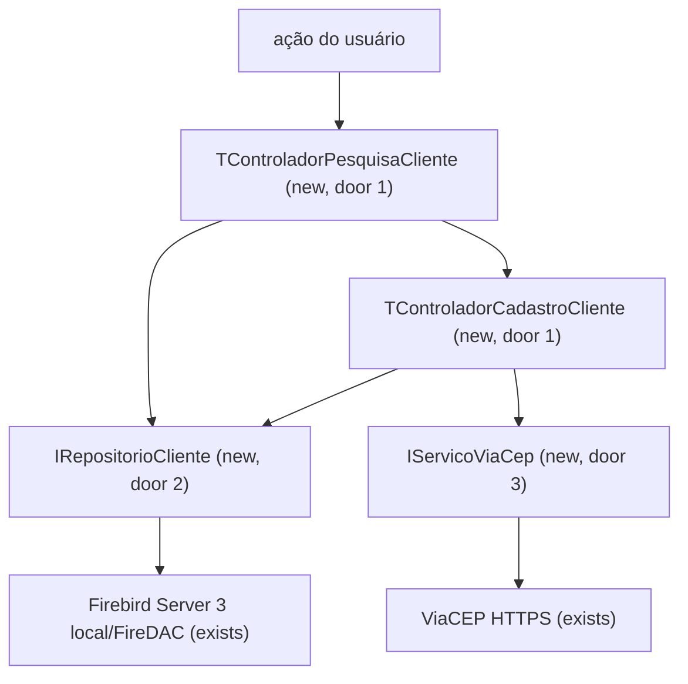
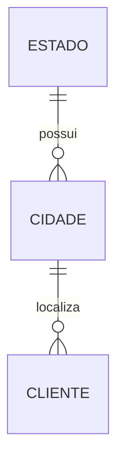

# Parte 03 - CRUD e pesquisa de clientes

## Problem

O sistema ainda não permite cadastrar, localizar, alterar ou excluir clientes conforme o enunciado, e eventos VCL poderiam concentrar regras de validação e acesso ao banco sem cobertura isolada.

Quando esta parte estiver pronta, pesquisa e edição funcionarão em forms DevExpress separadas, cada uma com seu controlador testável, persistência transacional e preenchimento de endereço pelo ViaCEP.

## Flow

Esta parte reutiliza conexão, migrações, entidades e o padrão de visão passiva da parte 01, além da navegação da parte 02.

## Impact

| Front | What changes |
| --- | --- |
| domain | `Cliente` passa a possuir regras de documento, CEP, nascimento e exclusão protegida; `EnderecoViaCep` representa o retorno externo |
| stored data | CRUD altera `CLIENTE`; ViaCEP pode inserir estado/cidade ausentes dentro da mesma transação do salvamento |
| external dependency | consultas HTTPS ao ViaCEP passam a ocorrer ao sair do campo CEP válido |
| UI | entram as forms `PesquisaCliente` e `CadastroCliente`, ambas DevExpress e com controladores próprios |

## Relations

One-way constraints: um cliente referencia exatamente uma cidade; UF é única; cidade é única por estado e nome (parte 01).

## Surface

None - nothing consumed outside; as superfícies são as duas forms e a chamada consumidora ao ViaCEP.

## Landing

| One-way door | Literal shape | Alternative rejected |
| --- | --- | --- |
| 1. um controlador por form | `TFormPesquisaCliente : IVisaoPesquisaCliente` + `TControladorPesquisaCliente`; `TFormCadastroCliente : IVisaoCadastroCliente` + `TControladorCadastroCliente` | um controlador compartilhado acumularia estado de duas telas e contrariaria a regra solicitada |
| 2. fronteira de persistência | `IRepositorioCliente` expõe incluir, alterar, excluir, obter por ID e pesquisar por `TFiltroCliente`; implementação FireDAC usa somente parâmetros | datasets ligados diretamente aos controles misturam consulta, navegação e regra de negócio |
| 3. fronteira de CEP | `IServicoViaCep.Consultar(CEP)` retorna encontrado/endereço ou erros tipados de formato, não encontrado e indisponível | HTTP dentro da form impede teste determinístico e tratamento consistente |
| 4. regra de exclusão | conjunto imutável de IDs protegidos `{1, 5, 8, 10, 15}` validado pelo controlador antes da transação | trigger ocultaria a regra da interface e ainda exigiria tratamento posterior da exceção |

- Nothing else in this change is hard to reverse.

## Criteria

### S1: Pesquisa de clientes (P1)

O usuário encontra registros e escolhe criar, editar ou excluir.

**Acceptance Criteria**

1. WHEN a tela de pesquisa abrir THEN o sistema SHALL listar clientes em grade ordenada por ID crescente com ID, nome, CPF/CNPJ, CEP, cidade, estado e data de nascimento.
2. WHEN filtros opcionais forem informados THEN o sistema SHALL combinar ID exato, nome contendo texto sem diferença de caixa, CPF/CNPJ por dígitos exatos, CEP por oito dígitos exatos, cidade contendo texto, estado por UF ou nome e data de nascimento exata.
3. WHEN nenhum registro corresponder THEN o sistema SHALL exibir a mensagem `Nenhum cliente encontrado` e desabilitar editar e excluir.
4. IF a consulta ao banco falhar THEN o sistema SHALL exibir uma mensagem de erro, manter os filtros digitados e não apresentar resultados antigos como atuais.
5. WHEN o usuário acionar novo ou editar THEN `TControladorPesquisaCliente` SHALL solicitar ao navegador a abertura de `TFormCadastroCliente` no modo correspondente e atualizar a grade após salvamento.

**Independent test:** usar repositório e navegador falsos para provar composição dos filtros, estados vazio/erro e atualização após edição.

### S2: Inclusão e alteração validadas (P1)

O usuário mantém todos os dados obrigatórios sem lógica de negócio na form.

**Acceptance Criteria**

6. WHEN um novo cliente válido for salvo THEN o sistema SHALL persistir exatamente um registro em transação e retornar seu ID inteiro gerado pela sequência.
7. WHEN um cliente existente válido for salvo THEN o sistema SHALL alterar exatamente o registro selecionado em transação sem modificar seu ID.
8. IF nome, CEP, CPF/CNPJ, endereço, número, bairro, cidade ou data de nascimento estiver vazio THEN o sistema SHALL impedir o salvamento e indicar o primeiro campo inválido.
9. IF CPF/CNPJ não tiver 11 ou 14 dígitos ou falhar nos dígitos verificadores THEN o sistema SHALL impedir o salvamento com a mensagem `CPF/CNPJ inválido`.
10. IF a data de nascimento for posterior à data local atual THEN o sistema SHALL impedir o salvamento com a mensagem `Data de nascimento não pode estar no futuro`.
11. WHEN Enter for pressionado em um editor de dados THEN a form SHALL mover o foco para o próximo controle da ordem de tabulação; no último editor, SHALL mover o foco para `Salvar`.
12. WHEN houver alterações não salvas e o usuário cancelar ou fechar THEN o sistema SHALL pedir confirmação antes de descartá-las.
13. IF a inclusão ou alteração falhar THEN o sistema SHALL reverter a transação, manter os valores editados e exibir uma mensagem sem detalhes de credenciais.

**Independent test:** executar o controlador com visão, relógio, repositório e transação falsos para cada validação, sucesso e rollback.

### S3: CEP integrado e resiliente (P1)

O endereço é preenchido quando o CEP é reconhecido sem impedir correção manual durante indisponibilidade externa.

**Acceptance Criteria**

14. WHEN o campo CEP perder o foco contendo oito dígitos THEN o sistema SHALL consultar `https://viacep.com.br/ws/{CEP}/json/` e sinalizar estado de carregamento até a resposta.
15. WHEN o ViaCEP retornar um endereço encontrado THEN o sistema SHALL preencher endereço, bairro, cidade e estado e manter número e complemento digitados.
16. IF o CEP não tiver exatamente oito dígitos THEN o sistema SHALL não chamar o ViaCEP e exibir `CEP inválido`.
17. IF o ViaCEP retornar HTTP 400 ou `erro=true` THEN o sistema SHALL exibir `CEP não encontrado` e manter os campos de endereço editáveis.
18. IF o ViaCEP estiver indisponível ou exceder 10 segundos THEN o sistema SHALL encerrar o carregamento, informar a indisponibilidade e preservar todos os valores digitados.
19. WHEN uma cidade/UF válida retornada pelo ViaCEP ainda não existir THEN o sistema SHALL criar ou reutilizar estado e cidade por chaves únicas antes de salvar o cliente.

**Independent test:** simular respostas encontrada, não encontrada, formato inválido, timeout e cidade nova sem acesso real à rede.

### S4: Exclusão protegida (P1)

O usuário exclui somente registros permitidos e confirma a perda.

**Acceptance Criteria**

20. WHEN o usuário solicitar a exclusão de um cliente fora de `{1, 5, 8, 10, 15}` THEN o sistema SHALL exibir confirmação contendo ID e nome antes de remover.
21. WHEN a confirmação de exclusão for aceita THEN o sistema SHALL excluir exatamente o cliente selecionado em transação e atualizar a grade.
22. IF o ID selecionado estiver em `{1, 5, 8, 10, 15}` THEN o sistema SHALL impedir a exclusão sem abrir transação e exibir `Cliente protegido não pode ser excluído`.
23. IF a exclusão falhar THEN o sistema SHALL reverter a transação, manter o registro na grade e exibir uma mensagem de erro.

**Independent test:** provar confirmação, cancelamento, IDs protegidos, sucesso e rollback com dublês, além de integração contra base temporária.

## Out of scope

| Excluded | Why |
| --- | --- |
| importação ou exportação de clientes | não solicitada |
| exclusão em lote | conflita com a confirmação individual e não foi solicitada |
| consulta em massa ao ViaCEP | o serviço alerta contra uso massivo e a necessidade é por edição |
| relatório | pertence à parte 04 |

## Assumptions

| Assumption | Chosen default | Rationale | Confirmed? |
| --- | --- | --- | --- |
| combinação de filtros | todos opcionais e combinados por `AND` | é previsível e cobre pesquisa por qualquer campo sem criar vários modos |
| obrigatoriedade | todos os campos, exceto `COMPLEMENTO`, são obrigatórios | produz cadastros úteis e preserva complemento como naturalmente opcional |
| pesquisa de nome/cidade | contém, sem diferença entre maiúsculas/minúsculas | comportamento esperado para texto livre |
| estado retornado pelo ViaCEP fora dos quatro estados dos dados de referência | inserir UF/estado e cidade sob as chaves únicas | permite atender CEPs nacionais sem violar os quatro registros iniciais exigidos |

**Open questions:** none - todas as decisões possuem default revisável acima.

## Observable

| Surface | Decision | Landing |
| --- | --- | --- |
| screen `PesquisaCliente` | empty state | AC 3 - mensagem e ações desabilitadas |
| screen `PesquisaCliente` | loading state | AC 1 - grade bloqueada durante consulta síncrona curta |
| screen `PesquisaCliente` | error state | AC 4 - filtros preservados e resultados antigos removidos |
| screen `PesquisaCliente` | unauthorised state | n/a - aplicação local não possui autenticação |
| screen `PesquisaCliente` | density and ordering | AC 1 - grade compacta por ID crescente |
| screen `PesquisaCliente` | destructive action confirms | AC 20 e AC 22 - confirmação nominal ou bloqueio |
| screen `CadastroCliente` | empty state | AC 6 e AC 8 - novo cadastro vazio com validação no salvar |
| screen `CadastroCliente` | loading state | AC 14 - consulta CEP sinalizada |
| screen `CadastroCliente` | error state | AC 13, AC 17 e AC 18 - dados preservados e mensagem contextual |
| screen `CadastroCliente` | unauthorised state | n/a - aplicação local não possui autenticação |
| screen `CadastroCliente` | density and ordering | AC 11 - ordem de tabulação define o fluxo de entrada |
| screen `CadastroCliente` | destructive action confirms | AC 12 - descarte de edição exige confirmação |
| dependency `ViaCEP` | error shape and codes | AC 16 a AC 18 - formato, não encontrado e indisponível separados |
| dependency `ViaCEP` | rate limits | n/a - uma consulta ocorre apenas após edição individual de CEP; uso massivo está fora do escopo |

## Sources

- [Teste Programador Delphi 2026.md](../../Teste%20Programador%20Delphi%202026.md) - fonte vinculante para CRUD, filtros, exclusão, CEP, Enter e campos.
- [ViaCEP](https://viacep.com.br/) - contrato oficial para oito dígitos, HTTP 400 e `erro=true`.
- [Transações FireDAC](https://docwiki.embarcadero.com/RADStudio/Athens/en/Managing_Transactions_%28FireDAC%29) - padrão oficial de commit e rollback explícitos.
