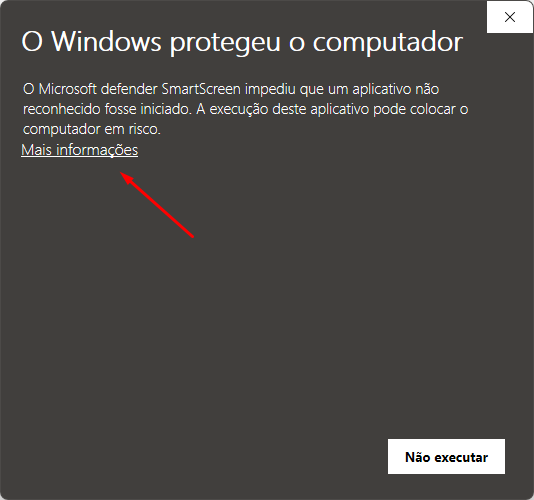
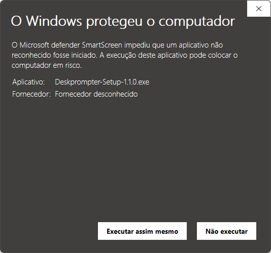
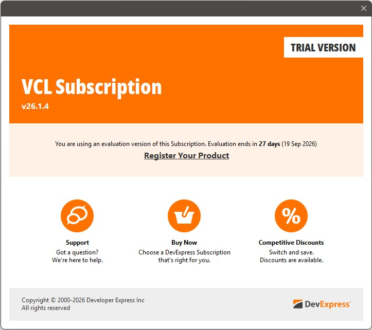
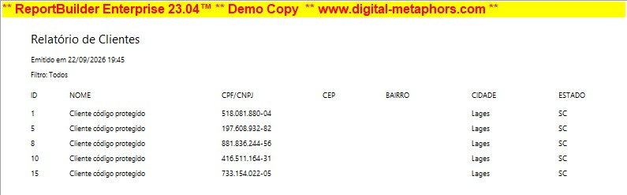
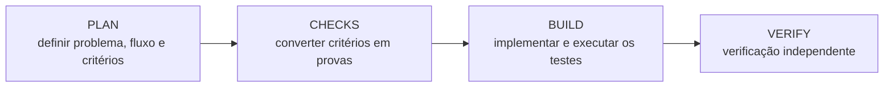
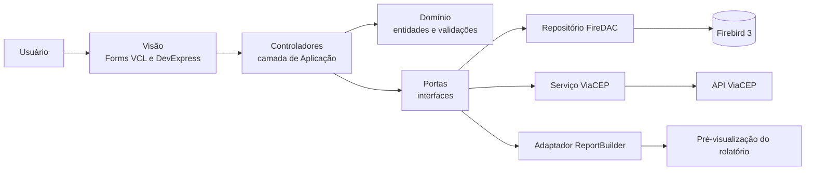

# CadCli

CadCli é uma aplicação desktop para cadastro e consulta de clientes, desenvolvida em Delphi 12 com VCL e componentes DevExpress. O sistema permite incluir, editar, pesquisar e excluir clientes, consultar endereços pelo ViaCEP e emitir relatórios com ReportBuilder.

Os dados são armazenados em um banco Firebird 3 local. Na primeira execução, **a aplicação cria o arquivo** `cadcli.fdb` e aplica automaticamente as migrações necessárias.

## Instalação

1. Execute `CadCli-Setup-x64.exe` como administrador.
2. Mantenha marcada a opção **Instalar Firebird 3**, a menos que o Firebird 3 x64 já esteja instalado como serviço local.
3. Conclua a instalação e abra o CadCli pelo atalho criado.

### Alerta do Windows ao abrir o instalador

Ao executar o instalador, o Microsoft Defender SmartScreen pode exibir a mensagem **O Windows protegeu o computador**. Isso acontece porque o executável ainda não possui reputação reconhecida pelo SmartScreen e o fornecedor pode aparecer como desconhecido; o aviso, por si só, não indica que o arquivo esteja infectado.

Antes de continuar, confirme que o instalador veio da página oficial de releases do CadCli e valide o arquivo `.sha256` publicado junto com ele. Depois, selecione **Mais informações**, confira o nome do executável e clique em **Executar assim mesmo**.

  
  

O instalador configura os arquivos necessários para executar o programa. O banco de dados é criado ao lado de `CadCli.exe` no primeiro uso e é preservado durante atualizações e na desinstalação.

## Aviso de versão trial

Ao iniciar o CadCli, pode aparecer esta mensagem:

Ela aparece porque o projeto foi compilado com uma instalação de avaliação do **DevExpress VCL**. O aviso é exibido pelo próprio DevExpress antes da tela principal e não representa erro no CadCli, no Firebird ou no banco de dados.

Para remover a mensagem, é necessário recompilar o projeto com uma licença comercial válida do DevExpress compatível com Delphi 12.

### Mensagem de demonstração no relatório

Ao visualizar um relatório, pode aparecer a faixa **ReportBuilder Enterprise — Demo Copy** no topo:

Essa faixa é adicionada pelo próprio **ReportBuilder**, porque o projeto foi compilado com uma versão de demonstração do componente. Ela não indica falha na geração do relatório e não altera os dados consultados pelo CadCli.

Para gerar relatórios sem essa identificação, é necessário recompilar o projeto com uma licença comercial válida do ReportBuilder compatível com Delphi 12.

## Como o projeto foi criado

O desenvolvimento foi conduzido com a skill **`tlc-spec-lean`**, um processo orientado por especificações que transforma requisitos em obrigações verificáveis antes da implementação:

Cada parte do sistema possui artefatos em `.specs/features`: um plano revisável, checks com provas concretas e, quando concluída, uma verificação independente. As decisões duradouras de arquitetura ficam registradas em `.specs/STATE.md`.

Esse processo foi usado para construir progressivamente a fundação e as migrações do banco, a tela principal, o cadastro e a pesquisa de clientes, a integração com ViaCEP, os relatórios e o instalador.

## Arquitetura

A aplicação usa uma arquitetura em camadas, com forms passivas e dependências externas acessadas por interfaces e adaptadores.

- **Visão:** coleta dados, chama o controlador e apresenta o resultado.
- **Aplicação:** coordena os casos de uso por meio de controladores e interfaces.
- **Domínio:** concentra entidades, filtros e regras de validação.
- **Infraestrutura:** implementa persistência FireDAC, comunicação HTTP e geração de relatórios.
- **Migrações:** criam e atualizam o banco de forma versionada e transacional.

## Vantagens e desvantagens

### Vantagens

- Regras de negócio ficam separadas das telas e do banco de dados.
- Controladores podem ser testados sem abrir forms reais.
- FireDAC, ViaCEP e ReportBuilder ficam isolados atrás de interfaces.
- Migrações versionadas tornam a criação e a atualização do banco reproduzíveis.
- Dependências podem ser substituídas por fakes nos testes.
- A separação de responsabilidades facilita manutenção e evolução do sistema.
- Os checks da `tlc-spec-lean` ligam cada requisito a uma prova executável.
- Operações de escrita e migrações usam transações explícitas com rollback, evitando manter alterações parciais quando uma etapa falha.
- Consultas recebem valores por parâmetros, inclusive textos com caracteres especiais, sem concatenar entradas do usuário ao comando SQL.
- O CadCli recusa uma base cuja versão seja mais nova que a suportada pelo executável, evitando que uma versão antiga manipule um esquema incompatível.
- A integração com ViaCEP possui timeout e resultados tipados para CEP inválido, não encontrado, serviço indisponível e resposta inválida; assim, o controlador trata cada situação sem depender de exceções ou apagar os dados já digitados.

### Desvantagens

- Há mais classes, interfaces e arquivos do que em um CRUD feito diretamente na form.
- A composição das dependências exige mais código inicial.
- O fluxo de uma ação atravessa várias camadas, o que aumenta a curva de aprendizado.
- Mudanças pequenas podem exigir ajustes em contratos, implementações e testes.
- Para aplicações muito pequenas e sem expectativa de evolução, o custo da arquitetura pode ser maior que o benefício.

## Tecnologias principais

- Delphi 12, VCL e Win64
- DevExpress VCL
- FireDAC e Firebird 3
- ReportBuilder
- ViaCEP
- DUnitX
- Inno Setup
