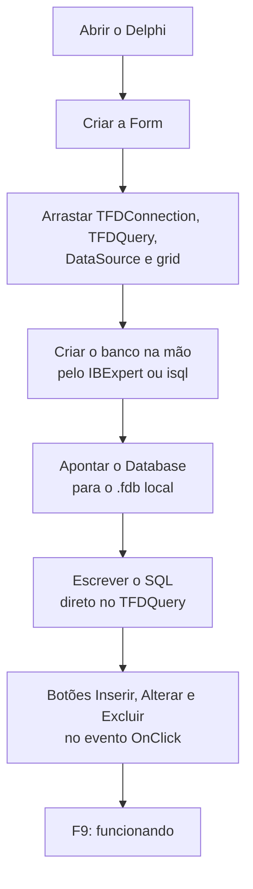
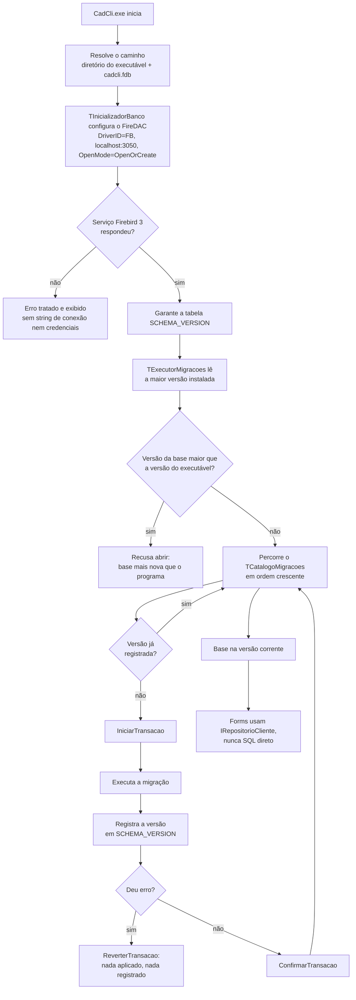

# CadCli

Sistema desktop de cadastro de clientes em Delphi 12 (VCL, Win64), desenvolvido como teste técnico para vaga de programador Delphi.

## O que o sistema faz

- **Tela principal** com menu horizontal `Sistema`, `Cadastros` e `Relatórios`, construída com componentes visuais DevExpress.
- **Cadastro de clientes** com inclusão, alteração, exclusão e pesquisa, validações de CPF/CNPJ, CEP e data de nascimento, e `Enter` funcionando como `Tab` entre os campos.
- **Pesquisa de clientes** por ID, nome, CPF/CNPJ, CEP, cidade, estado e data de nascimento, consultando o banco a cada busca, limitada a 50 registros e ordenável pelo cabeçalho da lista.
- **Consulta automática de CEP** na API ViaCEP ao sair do campo: CEP válido preenche endereço, bairro e cidade/estado; CEP inválido ou serviço fora do ar avisa o usuário sem apagar o que já foi digitado.
- **Regra de exclusão protegida**: clientes com ID 1, 5, 8, 10 ou 15 não podem ser excluídos.
- **Relatório de clientes em ReportBuilder**, com filtros por intervalo de IDs, por cidade/estado ou todos.
- **Banco Firebird 3** acessado por FireDAC, com esquema criado e evoluído automaticamente na inicialização.

### Modelo de dados

| Tabela | Conteúdo |
| --- | --- |
| `CLIENTE` | dados cadastrais, FK para `CIDADE` |
| `CIDADE` | cidades, FK para `ESTADO` |
| `ESTADO` | Minas Gerais, São Paulo, Rio de Janeiro e Bahia |
| `SCHEMA_VERSION` | controle interno de versão do esquema |

---

## Como instalar e executar

### Para usar o sistema

1. Execute `CadCli-Setup-x64.exe` como administrador.
2. Mantenha marcada a opção **Instalar Firebird 3** (marcada por padrão). Ela instala e inicia silenciosamente o Firebird 3 x64 como serviço local. Desmarque apenas se já houver um serviço Firebird 3 configurado em `localhost:3050`.
3. Abra o CadCli pelo atalho criado. Na primeira execução o sistema cria o banco `cadcli.fdb` ao lado do executável e aplica todas as migrações.

O banco do usuário é preservado em atualizações e na desinstalação.

### Para compilar a partir do código-fonte

Pré-requisitos:

- Delphi 12 (RAD Studio 23.0) com VCL e FireDAC
- DevExpress VCL para RS29
- ReportBuilder para Delphi 12 (Win64)
- Firebird 3 x64 instalado como serviço local em `localhost:3050`
- Inno Setup (somente para gerar o instalador)

Build da aplicação e da suíte de testes:

```bash
rsvars.bat
MSBuild.exe CadCli.dproj /t:Build /p:Config=Release /p:Platform=Win64
MSBuild.exe tests\CadCli.Testes.dproj /t:Build /p:Config=Debug /p:Platform=Win64
```

Execução dos testes:

```bash
.\tests\bin\Win64\Debug\CadCli.Testes.exe
```

A suíte tem 124 testes automatizados (DUnitX) cobrindo domínio, controladores, repositório sobre Firebird real, integração ViaCEP, forms e artefatos de entrega.

### Organização do repositório

```
src/Dominio/          regras e tipos de negócio, sem dependência de UI ou banco
src/Aplicacao/        controladores e interfaces (portas) das dependências
src/Infraestrutura/   FireDAC, HTTP, ViaCEP, adaptadores concretos
src/Migracoes/        uma unit por versão do esquema do banco
src/Visao/            forms DevExpress (views passivas)
tests/                runner DUnitX, testes e fakes
tools/                scripts de empacotamento e instalador
.specs/               planos, checks e verificações de cada entrega
```

---

## Decisões técnicas

### O caminho óbvio

O teste pede um CRUD com banco. Em Delphi, o caminho mais curto é conhecido e realmente funciona:



E as vantagens disso são reais, não devem ser minimizadas:

- **É rápido.** Da tela em branco ao CRUD funcionando são poucos minutos.
- **É visível.** Tudo aparece no Object Inspector; não existe indireção para seguir.
- **É o idioma nativo da ferramenta.** O RAD foi desenhado exatamente para isso, e qualquer desenvolvedor Delphi entende o código imediatamente.
- **Não tem cerimônia.** Sem interfaces, sem injeção de dependência, sem camadas.
- **Para escopo pequeno e estável, é a escolha certa.** Um utilitário interno que nunca vai crescer não paga o custo de abstração.

O problema não é o resultado imediato, é o que acontece depois:

- **O banco vira um artefato manual.** O `.fdb` foi criado por alguém, em algum momento, com passos que não estão registrados em lugar nenhum. Duas máquinas divergem e ninguém sabe qual é a correta. Alterar o esquema em produção vira um script avulso enviado por e-mail.
- **Não há como testar sem abrir tela.** A regra "ID 1, 5, 8, 10 e 15 não podem ser excluídos" mora no `OnClick` de um botão. Provar que ela vale exige uma pessoa clicando.
- **Uma regra passa a ter várias versões.** A validação de CPF no cadastro, na pesquisa e no relatório tende a ser escrita três vezes, e as três só concordam por coincidência.
- **Trocar qualquer peça é reescrever a tela.** Sair do Firebird, trocar o grid, mudar o serviço de CEP: tudo passa pela form.

### O caminho deste projeto, na persistência

Aqui o banco não é um arquivo que alguém criou: é uma consequência determinística do executável. Não existe `.sql` externo, não existe passo manual, não existe "rode este script antes".



As decisões por trás desse desenho:

- **Migrações são classes Delphi compiladas no `.exe`**, uma unit por versão (`Migracao.V001.EsquemaInicial.pas`, `Migracao.V002.DadosReferencia.pas`), registradas em `TCatalogoMigracoes`. Um script `.sql` solto pode ser perdido, editado ou aplicado fora de ordem; uma unit compilada viaja junto com o binário que depende dela. O executável e o esquema que ele espera são sempre a mesma entrega.
- **A criação limpa usa o mesmo histórico da atualização.** Não existe um caminho "banco novo" e outro "banco antigo" que possam divergir. Uma instalação nova aplica V001 e V002 exatamente como uma base antiga aplicaria apenas a pendente.
- **Cada migração e seu registro em `SCHEMA_VERSION` acontecem na mesma transação.** Se falhar, há rollback e a versão não é registrada — nunca sobra um esquema meio aplicado marcado como concluído.
- **Migração publicada é imutável.** Corrigir uma migração já entregue significa criar a versão seguinte, porque bases instaladas já aplicaram a anterior.
- **A base recusa abrir se for mais nova que o executável**, evitando que uma versão antiga do programa corrompa dados gravados por uma nova.
- **IDs vêm de sequências do Firebird**, nunca de `MAX(ID)+1`, que é uma condição de corrida esperando acontecer.
- **Todo SQL é parametrizado** e vive apenas nos repositórios. Forms e controladores conversam com `IRepositorioCliente` e não sabem que existe FireDAC.
- **Credenciais e string de conexão nunca aparecem em mensagem ou log.**

O resultado prático: a pesquisa filtra e ordena **no SQL**, não em memória. Isso não foi uma preferência estética — a primeira versão lia a tabela inteira e travava a tela, e a decisão AD-016 removeu a duplicata de regra que existia entre o filtro em memória e o filtro do banco. Duas implementações da mesma regra só concordam por coincidência.

A mesma lógica de isolamento vale para o resto: o ViaCEP fica atrás de `IServicoViaCep`, com timeout e resultados tipados; o ReportBuilder fica atrás de `IGeradorRelatorioCliente`; a navegação entre telas fica atrás de uma interface de navegação. Cada form é uma view passiva com exatamente um controlador, testável sem abrir janela. É por isso que 124 testes rodam por linha de comando e devolvem um código de saída.

---

## Planejamento e execução

O projeto foi construído em partes numeradas, cada uma com um ciclo próprio:

| Parte | Entrega |
| --- | --- |
| 01 | Fundação: projeto Win64, banco versionado, migrações |
| 02 | Tela principal, menu e navegação |
| 03 | CRUD de clientes, ViaCEP, repositório |
| 03.1 | Pesquisa consultando o banco, limitada e ordenável |
| 04 | Relatório em ReportBuilder |
| 05 | Identidade visual e instalador |

### A skill `tlc-spec-lean`

Todo o ciclo foi conduzido pela skill **tlc-spec-lean** (Tech Leads Club), que impõe quatro movimentos:

```
PLAN  →  CHECKS  →  BUILD  →  VERIFY
```

- **PLAN** — um documento com o problema, o fluxo de dados, o impacto por frente e, principalmente, as *one-way doors*: as decisões difíceis de reverter, cada uma com sua forma literal e a alternativa rejeitada. Critérios de aceite escritos em EARS (`WHEN ... THEN o sistema SHALL ...`). O plano é revisado por uma pessoa antes de qualquer código.
- **CHECKS** — cada critério vira um *check*: uma afirmação observável com valor concreto **mais a prova**, que é o comando cujo código de saída resolve a questão. Sem prova, não é check. Os checks ficam congelados depois de aprovados; um check errado é motivo para parar e perguntar, não para editar.
- **BUILD** — a implementação em si, livre. A skill deliberadamente não quebra a feature em quinze tarefas: granularidade compra ordenação, não correção. O que compra correção é cobertura de prova.
- **VERIFY** — um sub-agente independente, que **não** escreveu o código, roda todos os checks sobre a faixa de commits da feature e ainda injeta falhas deliberadas no código para confirmar que os testes realmente morrem quando deveriam. Um autor que revisa o próprio trabalho reproduz o próprio ponto cego.

Isso não é teatro de processo. Na Parte 03.1 o Verifier deu **FAIL na primeira rodada**: a regra de ordenação sem diferença de caixa estava afirmada para as colunas de cidade e estado, mas nenhuma asserção a provava — um mutante que removia o `UPPER` do SQL sobrevivia. O commit `ed559b9` acrescentou um cliente de teste com cidade `macapá` e estado `amapá` em minúsculas e quatro asserções novas. Só então a parte passou.

Decisões de arquitetura ficam registradas em `.specs/STATE.md` com ID, justificativa e status (uma decisão pode ser *superseded* por outra, como AD-001 foi por AD-011). Lições aprendidas com falhas de verificação ficam em `.specs/LESSONS.md`, mantido por script — só viram guia depois de se repetirem em features distintas.

### Sem hooks e sem MCPs

Não houve necessidade de nenhum dos dois:

- **Hooks** servem para forçar um comportamento automático a cada ação do agente. Aqui as regras do projeto já vivem em `AGENTS.md` (idioma, arquitetura, persistência, testes, estilo) e o portão de conclusão já é um script: `validate_verification.py` precisa sair com código 0. Um hook seria uma terceira cópia da mesma regra.
- **MCPs** servem para dar ao agente acesso a sistemas externos. Tudo que este projeto precisa é local e já acessível por linha de comando: `MSBuild`, o runner DUnitX, o `isql` do Firebird e o `git`. O único serviço externo do produto, o ViaCEP, é consumido pela aplicação e, nos testes, substituído por fake — teste unitário não acessa rede.

---

## Automação de build, entrega e instalação

- **Pós-build automático.** O `CadCli.dproj` executa `tools\CopiarBplsEntrega.ps1` ao final de cada build. O script lê o **cabeçalho PE do próprio `CadCli.exe`**, resolve o fechamento transitivo das BPLs importadas e copia para o diretório de entrega exatamente essas — nem uma a mais, nem uma a menos. Nada de lista mantida à mão que envelhece em silêncio: a lista é derivada do binário a cada build.
- **Por que existem BPLs.** A instalação DevExpress disponível é trial e fornece apenas `.bpl`/`.dcp`, sem `.dcu` nem fontes, o que impede o link estático (`F2613 Unit 'dxBar' not found`). A decisão AD-011 registra isso explicitamente: runtime packages apenas para DevExpress e para os pacotes Embarcadero que eles exigem; todo o resto é estático. O executável abre sem Delphi nem DevExpress no `PATH`.
- **A entrega é verificada por teste.** Existem testes automatizados que afirmam sobre o artefato de entrega: que `CadCli.exe` é PE `AMD64` e não existe variante Win32, que nenhuma DLL do runtime Firebird foi copiada para junto do executável, que há um único executável de aplicação no diretório. A regra de empacotamento não é documentação — ela fica vermelha quando é violada.
- **Testes que executam o `.exe` real.** As provas de inicialização ponta a ponta sobem o executável entregue, esperam a criação da base e fecham a janela por `WM_CLOSE`. Foi assim que se descobriu que faltava `FireDAC.VCLUI.Wait`: sem o provedor de cursor de espera, a conexão falha na primeira operação, e nenhum teste de unidade veria isso (AD-006).
- **Instalador Inno Setup.** Gera um único `CadCli-Setup-x64.exe`, exige elevação, recusa sistemas não x64, traz o instalador oficial do Firebird 3 x64 como payload interno e oferece sua instalação silenciosa como serviço por um checkbox marcado por padrão. Suporta instalação silenciosa (`/VERYSILENT /NORESTART`), registra-se no desinstalador do Windows, não sobrescreve o banco do usuário ao atualizar e **preserva o `cadcli.fdb` na desinstalação**, informando onde ele permaneceu.
- **Nenhuma DLL do Firebird ao lado do `.exe`.** O serviço e a biblioteca cliente pertencem à instalação do Firebird, não à pasta da aplicação — evitando duas instalações concorrentes na mesma máquina (AD-007).

---

## Nota sobre o escopo

O teste pedia um CRUD funcional. A entrega tem banco versionado por migrações transacionais, arquitetura em camadas com controladores testáveis, 124 testes automatizados, verificação independente por injeção de falhas e um instalador reproduzível.

A escolha foi deliberada: mostrar não só que o sistema funciona, mas como ele seria mantido depois do primeiro dia.
